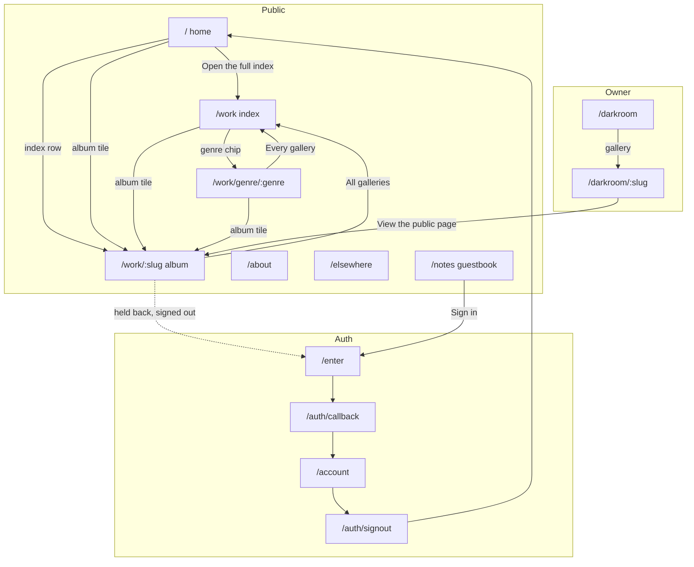
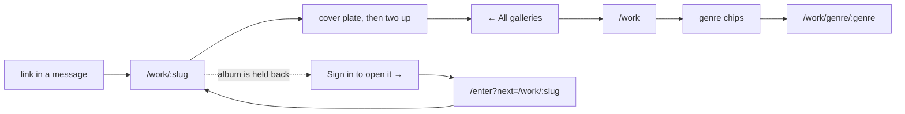
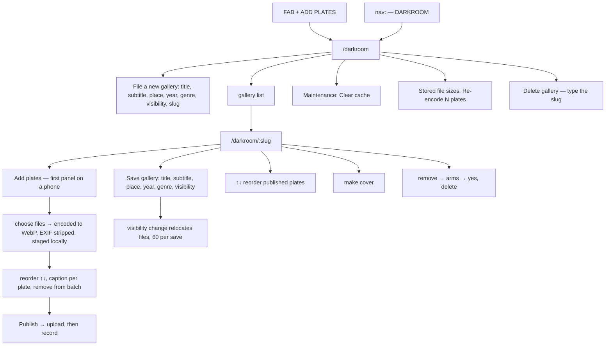
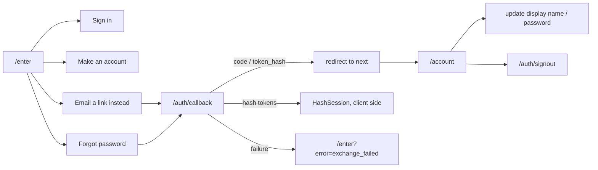

# UI/UX Flow — Be Untamed

**Audited 2026-09-05** against the running site, not the source. Every route was
opened, every control in `<main>` and the chrome enumerated, and the redirects
followed. Owner-only screens are read from code, because signing in as the
owner is not possible from here — those rows are marked **(from code)**.

Purpose: give the next session the state model and the known gaps without
re-deriving them.

> Filename note: the ask was `UI/UX Flow Be untamed.md`. A slash is a path
> separator, so it lives here instead.

---

## 1. Actors and states

There are three, and almost every difference on the site comes from which one
is looking.

| Actor | How the app knows | What changes |
| --- | --- | --- |
| **Visitor** (signed out) | `getViewer()` returns `null` | Held-back plates hidden, guestbook form replaced by a prompt, no FAB, cached read path |
| **Member** (signed in, `role: visitor`) | `viewer.isOwner === false` | Held-back plates visible, can leave and delete own notes, live read path |
| **Owner** | `viewer.isOwner === true` | Everything above plus `/darkroom`, the FAB, and the Darkroom nav item |

`getViewer()` is deduped per request with React `cache()`. The layout and the
page both call it; it costs one round trip, not two.

---

## 2. Route map

**Guarded.** `/darkroom` and `/darkroom/:slug` redirect to
`/enter?next=…` when signed out, and to `/work` when signed in without the
owner role. `/account` redirects to `/enter?next=%2Faccount`. `/enter`
redirects to `/account` when already signed in. Verified by following each.

---

## 3. Flow — a visitor looking at photographs

Controls present at each step, as measured:

| Screen | Chrome | In `main` |
| --- | --- | --- |
| `/` | wordmark → `/`, `[Sign in]`, theme toggle, 5 nav items | ticker pause, mailto, 6 album tiles, `Open the full index`, 4 genre chips, 6 index rows, 2 outbound sites, `/work` |
| `/work` | same | `Sign in to open them` (only when held-back sets exist and signed out), 3 genre chips, 6 album tiles |
| `/work/:slug` | same | `← All galleries` only |
| `/work/:slug` (held back, signed out) | same | `← All galleries`, `Sign in to open it →` |
| `/work/genre/:genre` | same | `← Every gallery`, album tiles |
| `/notes` (signed out) | same | `Sign in` |

---

## 4. Flow — the owner publishing a set

**(from code — the owner screens cannot be opened from here.)**

Server actions and what each one touches:

| Action | Writes | Invalidates |
| --- | --- | --- |
| `createAlbum` | `albums` insert | `/darkroom`, `/work`, albums tag |
| `updateAlbum` | `albums` row + moves files between buckets | darkroom, work, album, every genre page, albums tag |
| `recordPhoto` | `photos` insert | album paths, albums tag |
| `movePhoto` | renumbers the album's `position` | darkroom + public album |
| `setCover` | clears then sets `is_cover` | album paths |
| `deletePhoto` | `photos` delete + storage remove | album paths |
| `swapPlateFile` | `photos.path/width/height` + old object delete | darkroom, work |
| `deleteAlbum` | cascade + storage cleanup | darkroom, work |

---

## 5. Flow — auth

---

## 6. Audit — what is wrong or missing

Ordered by how much it costs someone using the site.

| # | Sev | Where | Finding |
| --- | --- | --- | --- |
| F1 | MED | `/enter` | The four modes are buttons, not routes. `/enter` cannot be linked in the mode someone needs — a "make an account" link from anywhere lands on Sign in. `next` survives, the mode does not. |
| F2 | MED | `/notes` | The guestbook is empty and reachable from the footer on every page. On album pages it is hidden while empty and signed out; the standalone page is not, so the one route dedicated to it is the one that looks abandoned. |
| F3 | MED | `/work/:slug` | One exit, `← All galleries`. Deliberate — the site is a link sent to someone already in a conversation — but it means a visitor who arrives from search has no way sideways. Recorded, not a defect. |
| F4 | LOW | `/darkroom/:slug` | `Save gallery` and `Delete gallery` sit in the same panel. The delete needs the slug typed, so it is guarded, but the two live closer together than their consequences differ. |
| F5 | LOW | chrome | The nav rail scrolls on a phone and `05 Guestbook` sits off-screen. There is a fade cue; there is no indicator of how many items remain. |
| F6 | LOW | `/work` | Genre chips only appear for genres with something filed. Correct, but it means the set of chips changes as content is added, and a link to an empty genre page still resolves. |
| F7 | INFO | data | Three of six albums carry a `year`. The index sorts by it, so the undated three fall to upload order. Not a code defect — a content gap that changes the order shown. |
| F8 | INFO | build | `unstable_cache` survives a local rebuild. A stale entry reads exactly like a broken query; clear `.next/cache` before concluding an ordering or filter change did not work. |

### Known-good, verified this pass

- Every guarded route redirects correctly, signed out and signed in without the role.
- The anonymous read path is cached behind a session-less client, so a held-back gallery's plates cannot enter the cache. Checked on the rendered response: no `gallery-private` path and no held-back badge.
- Destructive controls are in the error colour, and removing a plate takes two taps with a four-second disarm.
- Layout holds at 320, 375, 390, 414 and 430px across `/`, `/work`, `/about`, `/elsewhere` and `/notes`.

---

## 7. Rules that keep being re-learned

1. **A layout claim is only true if a browser was asked.** `overflow-x: clip`
   means a page can be six times too wide and look calm in the DOM.
2. **An unpinned `auto` grid track takes its width from the widest child's
   min-content.** This has caused two separate blowouts. Every single-column
   grid in `globals.css` is pinned with `minmax(0, 1fr)`; keep it that way.
3. **Sticky is bound by its containing block.** As a direct grid item it has
   only its own row to travel in. It needs a `display: block` wrapper.
4. **Measure rows by vertical overlap, not by bucketing the top edge.**
   Deliberate offsets put a pair in different buckets and read as broken.
5. **Do not audit this site as a funnel.** It is a fast showcase whose links
   are sent to someone already talking on WhatsApp. A missing call to action is
   not a defect here.
